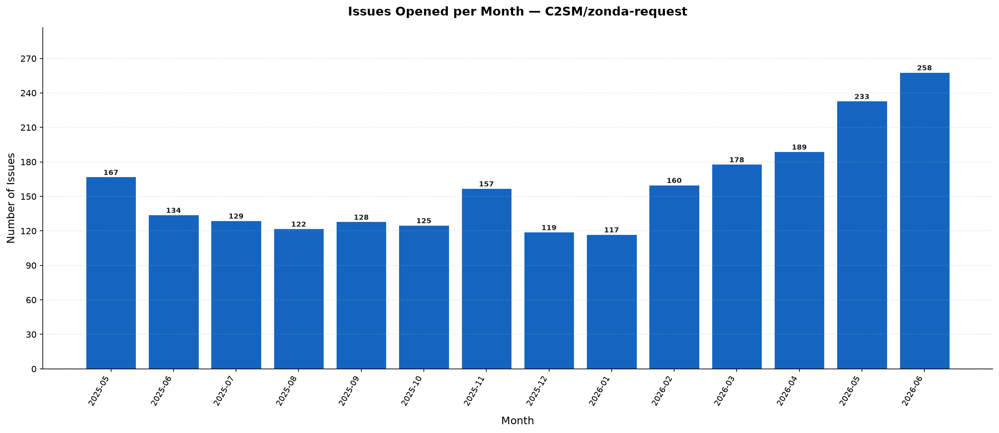

# zonda-statistics
Extract statistics from zonda-requests

Raw data backing this report is stored in [csv/](csv/); each table below is generated from its corresponding CSV file.

## License

[MIT](LICENSE)

<!-- STATS:START -->
> **Generated:** 2026-07-01 11:59 UTC  
> **Repository:** [C2SM/zonda-request](https://github.com/C2SM/zonda-request)

---

## Overview

| Metric | Value |
|--------|-------|
| Total Issues | **2366** |
| Open Issues | 139 (5.9%) |
| Closed Issues | 2227 (94.1%) |
| Unique Contributors | 351 |
| Distinct Labels | 16 |
| Total Label Assignments | 4706 |
| First Issue | 2025-05-05 |
| Latest Issue | 2026-07-01 |

## Label Statistics

| Label | Count | % of All Issues |
|-------|------:|----------------:|
| `data request` | 2338 | 98.8% |
| `completed` | 1766 | 74.6% |
| `failed` | 357 | 15.1% |
| `invalid` | 141 | 6.0% |
| `aborted` | 31 | 1.3% |
| `submitted` | 26 | 1.1% |
| `enhancement` | 10 | 0.4% |
| `bug` | 9 | 0.4% |
| `discussion` | 8 | 0.3% |
| `testsuite` | 8 | 0.3% |
| `frontend` | 4 | 0.2% |
| `v2.1` | 3 | 0.1% |
| `external bug` | 2 | 0.1% |
| `v2.0` | 1 | 0.0% |
| `backend` | 1 | 0.0% |
| `v2.2` | 1 | 0.0% |

> **9** issues (0.4%) carry no label.

## Issue States

| State | Count | Percentage |
|-------|------:|-----------:|
| Closed | 2227 | 94.1% |
| Open | 139 | 5.9% |

## Issue Resolution Time

Based on **2227** closed issues.

| Metric | Days |
|--------|-----:|
| Average | 7.7 |
| Median | 7 |
| Fastest | 0 |
| Slowest | 185 |

| SLA Bucket | Count | % of Closed |
|------------|------:|------------:|
| Closed within 1 day | 253 | 11.4% |
| Closed within 7 days | 1873 | 84.1% |
| Closed within 30 days | 2212 | 99.3% |

## Top Contributors (by Issues Opened)

| Rank | User | Issues | % of Total |
|-----:|------|-------:|-----------:|
| 1 | [stelliom](https://github.com/stelliom) | 135 | 5.7% |
| 2 | [janisklamt](https://github.com/janisklamt) | 70 | 3.0% |
| 3 | [krishaizl](https://github.com/krishaizl) | 51 | 2.2% |
| 4 | [criess374](https://github.com/criess374) | 50 | 2.1% |
| 5 | [AngeloCampanaleCMCC](https://github.com/AngeloCampanaleCMCC) | 50 | 2.1% |
| 6 | [mjaehn](https://github.com/mjaehn) | 41 | 1.7% |
| 7 | [shirareznik](https://github.com/shirareznik) | 41 | 1.7% |
| 8 | [LudovicoMattavelli](https://github.com/LudovicoMattavelli) | 39 | 1.6% |
| 9 | [donuhr](https://github.com/donuhr) | 38 | 1.6% |
| 10 | [mm10525](https://github.com/mm10525) | 34 | 1.4% |
| 11 | [maymeret](https://github.com/maymeret) | 34 | 1.4% |
| 12 | [jvicenciov](https://github.com/jvicenciov) | 33 | 1.4% |
| 13 | [awyszogrodzki](https://github.com/awyszogrodzki) | 31 | 1.3% |
| 14 | [Chao123-cyber](https://github.com/Chao123-cyber) | 30 | 1.3% |
| 15 | [kathaepp](https://github.com/kathaepp) | 29 | 1.2% |

## Issues per Year

| Year | Count | % of Total |
|------|------:|-----------:|
| 2025 | 1081 | 45.7% |
| 2026 | 1285 | 54.3% |

## Issues per Month

### Monthly Summary

| Metric | Value |
|--------|-------|
| Average Issues / Month | 157.7 |
| Peak Month | 2026-06 — 404 issues |
| Quietest Month | 2026-07 — 4 issues |
| Months with Activity | 15 |

### Full Monthly Breakdown

| Month | Count |
|-------|------:|
| 2025-05 | 167 |
| 2025-06 | 134 |
| 2025-07 | 129 |
| 2025-08 | 122 |
| 2025-09 | 128 |
| 2025-10 | 125 |
| 2025-11 | 157 |
| 2025-12 | 119 |
| 2026-01 | 117 |
| 2026-02 | 160 |
| 2026-03 | 178 |
| 2026-04 | 189 |
| 2026-05 | 233 |
| 2026-06 | 404 |
| 2026-07 | 4 |

## Issues by Day of Week (UTC)

| Day | Count | % of Total |
|-----|------:|-----------:|
| Monday | 369 | 15.6% |
| Tuesday | 462 | 19.5% |
| Wednesday | 530 | 22.4% |
| Thursday | 419 | 17.7% |
| Friday | 309 | 13.1% |
| Saturday | 124 | 5.2% |
| Sunday | 153 | 6.5% |

> Most issues are opened on **Wednesday**.

## Issues by Hour of Day (UTC)

| Hour (UTC) | Count |
|:----------:|------:|
| 00:00 | 7 |
| 01:00 | 6 |
| 02:00 | 5 |
| 03:00 | 14 |
| 04:00 | 14 |
| 05:00 | 25 |
| 06:00 | 54 |
| 07:00 | 101 |
| 08:00 | 248 |
| 09:00 | 263 |
| 10:00 | 202 |
| 11:00 | 192 |
| 12:00 | 226 |
| 13:00 | 239 |
| 14:00 | 236 |
| 15:00 | 168 |
| 16:00 | 103 |
| 17:00 | 62 |
| 18:00 | 63 |
| 19:00 | 52 |
| 20:00 | 35 |
| 21:00 | 21 |
| 22:00 | 19 |
| 23:00 | 11 |

> Peak activity at **09:00 UTC**.

## Most Common Label Combinations

| Labels | Count |
|--------|------:|
| `completed` + `data request` | 1745 |
| `data request` + `failed` | 339 |
| `data request` + `invalid` | 140 |
| `data request` + `submitted` | 25 |
| `aborted` + `data request` | 21 |
| `completed` + `data request` + `failed` | 8 |
| `data request` + `discussion` + `failed` | 4 |
| `aborted` + `completed` + `data request` + `testsuite` | 4 |
| `aborted` + `completed` + `data request` + `failed` | 2 |
| `bug` + `external bug` | 2 |

## Issues Carrying the Most Labels

| Issue | Title | Labels |
|-------|-------|-------:|
| [#1698](https://github.com/C2SM/zonda-request/issues/1698) | Testsuite MCH/ICON-CH2 | 5 |
| [#414](https://github.com/C2SM/zonda-request/issues/414) | ICON-CAP | 4 |
| [#564](https://github.com/C2SM/zonda-request/issues/564) | ICON-CH1 | 4 |
| [#565](https://github.com/C2SM/zonda-request/issues/565) | ICON-CH2 | 4 |
| [#1697](https://github.com/C2SM/zonda-request/issues/1697) | Testsuite DWD/ICON-D2 | 4 |

---

*Statistics generated by `extract_statistics.py` on 2026-07-01 11:59 UTC.*
<!-- STATS:END -->
